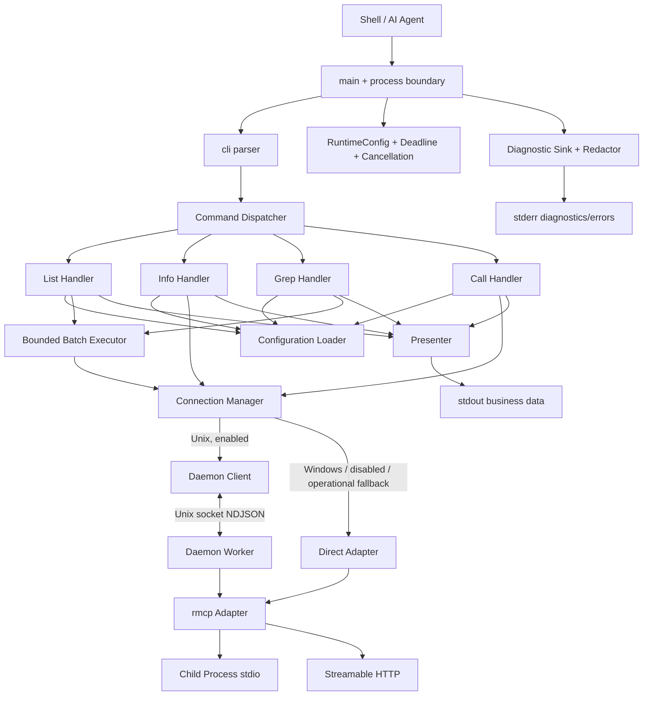
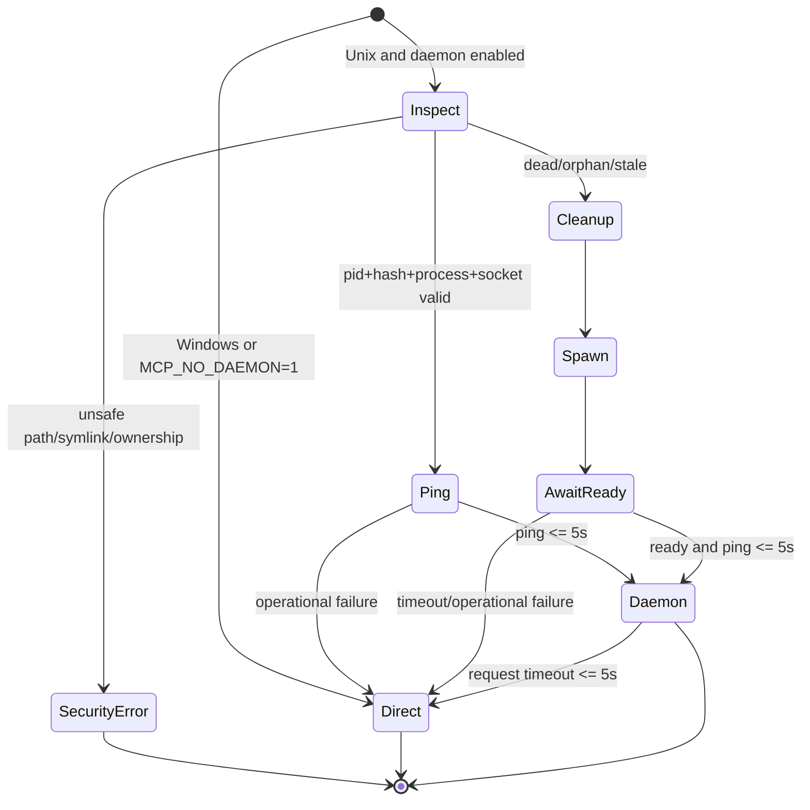
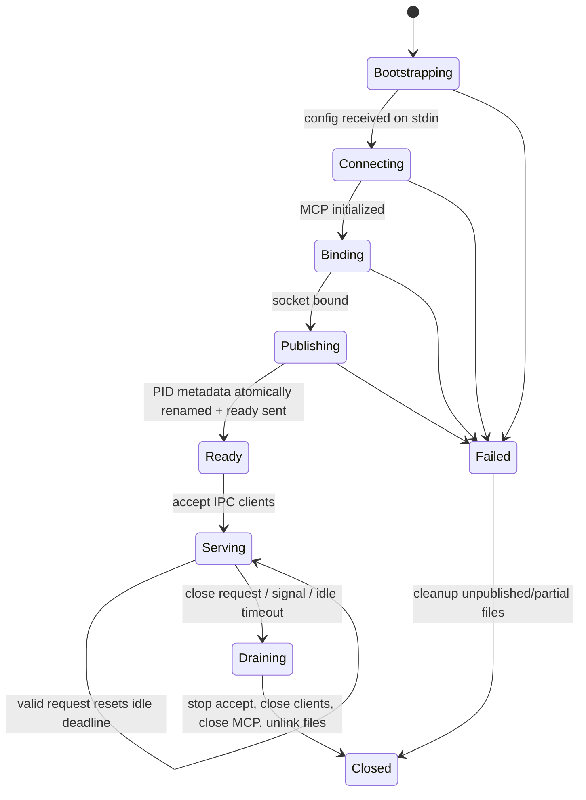

# mcp-cli（Rust）技术设计文档

## Overview

### 目标与范围

本设计定义 `mcp-cli` 的 Rust 等价实现。`requirements.md` 是行为规范的唯一准绳；`doc/design.md` 与 `reference/mcp-cli` TypeScript/Bun 代码仅用于识别兼容接口、输出习惯和既有测试场景。实现提供单一 `mcp-cli` 二进制，覆盖 list、info、grep、call，支持 rmcp stdio 与 Streamable HTTP，并在 Linux/macOS 优先使用每服务器一个 Unix daemon，在 Windows 或 `MCP_NO_DAEMON=1` 时使用 direct 连接。

关键设计目标如下：

- 保持命令语法、配置字段、stdout/stderr、退出码和无颜色输出的确定性。
- 让配置替换、配置校验、两类 glob、重试计算、错误映射、排序和格式化成为纯函数。
- 以单一连接接口隔离 rmcp 版本与传输差异；命令层不依赖 rmcp 具体类型。
- 以绝对 deadline 约束连接、daemon 快速探测、重试等待和 MCP 请求。
- 将 daemon 视为不可信的本地 IPC 边界：私有目录、安全文件名、受限 NDJSON 帧、同 UID 校验、原子发布和敏感数据脱敏。
- 所有正常、错误、超时和取消路径都可终止并释放本命令拥有的 direct/IPC 资源。

### 与参考实现的取舍

参考实现确认了公开语法、配置优先级、过滤优先级、5 秒 daemon 快速回退、每服务器 worker 和有界并发等意图；本设计不复制以下不满足需求的实现细节：

- 不把替换后的服务器配置放入 daemon 命令行；改由子进程 stdin 传输。
- 不假定一次 socket `read` 对应一个 JSON 请求；实现真正的 NDJSON 增量分帧。
- 不直接用服务器名称构造 socket/PID 路径；使用哈希后的 `ServerId`。
- `call` 成功输出完整 `Tool_Result` JSON，而不是只提取 text content。
- 非法运行时环境变量不静默回退默认值，而是返回 `INVALID_RUNTIME_CONFIG`。
- `info <server> <tool>` 输出纯 JSON Schema，使整个 stdout 可重新解析。

### 技术研究与设计依据

- 官方 Rust MCP SDK 使用 Tokio，并提供客户端、子进程 stdio 和 Streamable HTTP 能力，因此将 rmcp 封装在 transport adapter 内，而不自行实现 MCP 生命周期：[modelcontextprotocol/rust-sdk](https://github.com/modelcontextprotocol/rust-sdk)。
- Streamable HTTP 以 HTTP POST/GET 工作，并可通过 SSE 传递服务端消息；deadline 必须覆盖建连和流读取，而不能只包住首次 HTTP 响应：[MCP Streamable HTTP transport](https://modelcontextprotocol.io/specification/2025-03-26/basic/transports)。
- Tokio 提供异步 I/O、取消与背压基础；NDJSON 仍采用项目自有的字节级 codec，以便在超过 1 MiB 时立即关闭对应 IPC 客户端，而非继续丢弃超长行：[tokio-rs/tokio](https://github.com/tokio-rs/tokio)。
- property-based testing 选用 `proptest`，利用输入生成与 shrinking 验证纯逻辑和分帧状态机：[proptest-rs/proptest](https://github.com/proptest-rs/proptest)。

以上外部资料仅用于确认公共库能力；具体 API 在实现时以锁定版本的 rustdoc 与编译器为准。上述内容已为遵守许可要求而改写。

### 主要技术决策

| 领域 | 决策 | 理由 |
|---|---|---|
| 异步运行时 | Tokio multi-thread runtime | rmcp 生态一致，支持进程、网络、信号、时间和同步原语 |
| CLI | clap 定义帮助/版本，项目兼容解析器负责语法与建议 | clap 保证文档化，纯解析器保证需求规定的稳定错误 |
| MCP | rmcp 2.x，版本精确锁入 `Cargo.lock` | 避免自实现协议；adapter 屏蔽小版本 API 变化 |
| 序列化 | serde + serde_json | 配置、Tool_Result、NDJSON 共用模型 |
| 错误 | `thiserror` 内部错误 + `CliError` 边界映射 | 保留 source，同时固定用户可见类型和退出码 |
| 哈希 | SHA-256 全摘要 | 配置陈旧检测与安全文件名均有足够碰撞强度 |
| PBT | proptest，每个 property 至少 100 cases | 适合 glob、替换、规范化、分帧、重试和排序等纯逻辑 |

## Architecture

### 分层架构



依赖方向为 `commands -> application services -> domain/policy -> adapters`。`domain` 不依赖 Tokio、rmcp、文件系统或终端；外部行为通过 trait 注入，便于固定时钟、随机源、环境、TTY、文件系统视图和 mock transport。

### crate 与模块布局

```text
src/
├── main.rs
├── lib.rs
├── cli.rs
├── runtime.rs
├── config/
│   ├── mod.rs
│   ├── discover.rs
│   ├── substitute.rs
│   ├── validate.rs
│   └── canonical.rs
├── policy/
│   ├── tool_filter.rs
│   ├── search_glob.rs
│   ├── retry.rs
│   └── redact.rs
├── connection/
│   ├── mod.rs
│   ├── direct.rs
│   ├── manager.rs
│   └── rmcp_adapter.rs
├── daemon/
│   ├── mod.rs
│   ├── client.rs
│   ├── worker.rs
│   ├── paths.rs
│   ├── metadata.rs
│   └── codec.rs
├── commands/
│   ├── mod.rs
│   ├── list.rs
│   ├── info.rs
│   ├── grep.rs
│   └── call.rs
├── error.rs
└── output.rs
```

Unix 专属实现位于 `#[cfg(unix)]` 模块；Windows 构建提供同一 `ConnectionManager` 接口的 direct-only 分支，不引用 `UnixStream`、Unix 权限或信号 API。

### 顶层执行流程

```mermaid
sequenceDiagram
    participant U as User
    participant M as main
    participant C as ConfigLoader
    participant H as CommandHandler
    participant CM as ConnectionManager
    participant P as Presenter

    U->>M: argv / env / stdin
    M->>M: parse CLI and RuntimeConfig
    M->>M: create command Deadline + CancellationToken
    M->>C: load(explicit path, env, cwd, home)
    C-->>M: ValidatedConfig + SecretSet
    M->>H: execute(command context)
    H->>CM: acquire target connection(s)
    CM-->>H: McpConnection
    H->>H: apply policy, collect, sort
    H->>CM: close command-owned handles
    H-->>P: CommandOutcome
    P-->>U: business output -> stdout
    M-->>U: diagnostics/error -> stderr; exit code
```

`main` 是唯一渲染顶层 `Structured_Error` 的位置。命令、连接、daemon client 和配置层返回 typed error，不能自行重复打印。批处理中的单服务器失败被转换成 list 失败项或 grep warning，属于命令定义的部分结果；其余顶层失败统一映射一次。

### 连接选择状态机



只有 daemon 的可用性故障可回退 direct；符号链接、错误所有者、越界路径或无法验证的目标进程属于安全错误，不能用回退掩盖。

### Daemon worker 状态机



启动互斥使用 `<server-id>.lock` 的原子 `create_new`/文件锁。worker 只有在 MCP 初始化、socket 绑定和 PID 元数据原子发布全部完成后才发送 ready；任何中间失败都不公布可复用状态。

### Deadline、重试与取消传播

命令分发前创建 `Deadline(Instant)`。配置读取、daemon 探测、MCP connect、重试 sleep、请求和关闭均接收 `CommandContext { deadline, cancellation }`。每个可等待操作以 `min(局部上限, remaining)` 为上限；总预算耗尽统一产生 `TIMEOUT`。SIGINT/SIGTERM 首先触发 cancellation，进入有界 cleanup，再按 130/143 退出。

重试循环将“首次尝试 + `Retry_Limit` 次重试”视为同一操作。仅 `ErrorClass::Transient` 可重试；每次失败重新读取剩余预算。第 `attempt` 次重试等待（从 0 开始）的抖动前延迟为 `min(base * 2^attempt, 10s)`，实际延迟在闭区间 `[75%, 125%]`。若实际延迟不小于剩余预算，停止并返回 `TIMEOUT`，不启动没有预算的下一次尝试。

### 批处理与确定性

list/grep 按服务器名称的 `BTreeMap` 顺序创建任务，用 `Semaphore` 限制活跃服务器任务不超过 `Concurrency_Limit`。任务失败只形成该服务器结果，不取消其他任务。所有任务结束后再排序和格式化：list 使用 `(server_name, tool_name)`；grep 使用 `(server_name, tool_name)`。info/call 不进入批处理器，连接上限固定为 1。

### 输出边界

- list/info/grep：stdout 人类可读文本；`info server tool` 的文本就是格式化 JSON Schema。
- call 成功：stdout 只有完整 `Tool_Result` 的一个 JSON 值和结尾换行。
- Structured_Error、warning、debug、stdio server stderr：只写 stderr。
- ANSI 决策按实际目标流分别计算；非 TTY 或存在 `NO_COLOR` 时禁止 ANSI。
- `MCP_DEBUG` 只增加 stderr 诊断，不影响 stdout 字节和退出码。
- Presenter 输入先经过 `Redactor`；Authorization、Cookie、配置 env/header 的非空值注册为 secret，并在错误、debug 和 daemon 诊断中替换为 `[REDACTED]`。

## Components and Interfaces

### 1. CLI Parser 与命令分发

公开模型：

```rust
pub enum CommandSpec {
    List { with_descriptions: bool },
    Info { server: String, tool: Option<String>, with_descriptions: bool },
    Grep { pattern: String, with_descriptions: bool },
    Call { server: String, tool: String, inline_json: Option<String> },
    Help,
    Version,
}

pub struct CliInvocation {
    pub command: CommandSpec,
    pub config_path: Option<PathBuf>,
}

pub fn parse_cli(args: impl IntoIterator<Item = OsString>)
    -> Result<CliInvocation, CliError>;
```

clap 负责生成公开帮助、版本和选项元数据；`parse_cli` 在无 I/O 的兼容层中执行以下语法规则：

1. CLI `-c/--config` 优先于环境变量；`-d` 可位于子命令前后。
2. 无位置参数为 List；单一非别名名称为 Info(server)。
3. info/call 同时接受 `server tool` 与 `server/tool`，只在第一个 `/` 分割，空 server 或空 tool 非法。
4. call 最多接受一个 shell 位置参数作为内联 JSON；带空格 JSON 必须由 shell 引号保护。额外位置参数报错，而非静默拼接。
5. 未知选项、常见别名、歧义 `server tool`、缺参和多余参数生成稳定建议。
6. config 路径保留 `OsString`/`PathBuf` 以支持非 UTF-8 Unix 路径；命令名、服务器名、工具名和 JSON 必须是 UTF-8，否则为 `INVALID_ARGUMENTS`。

隐藏的 `__daemon` 入口使用独立内部 parser，不出现在 help；它只接受非敏感 `ServerId`、预期 config hash 和父进程标识，服务器配置从 stdin 读取。

### 2. RuntimeConfig 与 CommandContext

```rust
pub struct RuntimeConfig {
    pub timeout: Duration,
    pub concurrency: NonZeroUsize,
    pub max_retries: u32,
    pub retry_base_delay: Duration,
    pub strict_env: bool,
    pub daemon_enabled: bool,
    pub daemon_idle_timeout: Duration,
    pub debug: bool,
}

pub struct CommandContext {
    pub deadline: Deadline,
    pub cancellation: CancellationToken,
    pub diagnostics: Arc<dyn DiagnosticSink>,
}

pub trait Clock: Send + Sync {
    fn now(&self) -> Instant;
    fn sleep_until(&self, deadline: Instant) -> BoxFuture<'_, ()>;
}

pub trait JitterSource: Send + Sync {
    fn factor_basis_points(&mut self) -> u16; // 7500..=12500
}
```

所有数值环境变量执行严格十进制解析和上界检查，拒绝零（仅 max retries 可为零）、负数、溢出、尾随字符和非有限表示。错误包含变量名，不包含其他环境内容。测试注入 fake clock 与固定 jitter。

| 环境变量 | 默认值 | 约束 |
|---|---:|---|
| `MCP_TIMEOUT` | 1800 秒 | 正整数，总命令 deadline |
| `MCP_CONCURRENCY` | 5 | 正整数 |
| `MCP_MAX_RETRIES` | 3 | 非负整数，表示首次尝试后的次数 |
| `MCP_RETRY_DELAY` | 1000 毫秒 | 正整数 |
| `MCP_STRICT_ENV` | true | 仅 `false`/`0` 关闭 |
| `MCP_NO_DAEMON` | false | 仅 Unix 且值不为 `1` 时启用 daemon |
| `MCP_DAEMON_TIMEOUT` | 60 秒 | 正整数 |
| `MCP_DEBUG` | false | 启用时仅增加 stderr 诊断 |

### 3. ConfigurationLoader

```rust
pub struct LoadRequest<'a> {
    pub cli_path: Option<&'a Path>,
    pub env_path: Option<&'a OsStr>,
    pub cwd: &'a Path,
    pub home: &'a Path,
    pub env: &'a dyn EnvSource,
    pub strict_env: bool,
}

pub struct LoadedConfig {
    pub source: PathBuf,
    pub servers: BTreeMap<String, ServerConfig>,
    pub secrets: SecretSet,
}

pub trait ConfigurationLoader {
    fn discover(&self, request: &LoadRequest<'_>) -> Result<PathBuf, ConfigError>;
    async fn load(&self, request: LoadRequest<'_>) -> Result<LoadedConfig, ConfigError>;
}
```

处理管线固定为：路径选择 → 有界读取 → JSON syntax 解析 → 递归环境替换 → 顶层/字段类型验证 → URL/运行字段语义验证 → 强类型反序列化 → 确定性存储。显式路径读取失败不搜索默认路径；默认路径失败列出三个绝对搜索路径。JSON syntax 错误保留文件路径、line、column。字段错误保留 server 与 JSON field path。

环境替换只对已解析 JSON 的字符串值执行，不替换对象键，也不对替换结果进行二次展开，因此环境值中的 `${OTHER}` 是普通文本，不存在递归或循环替换。严格模式先收集全部缺失变量名，再返回不含值的错误；非严格模式逐个唯一变量告警并替换为空串。

### 4. Canonicalizer、ConfigHash 与 ServerId

```rust
pub fn canonical_json(value: &Value) -> Vec<u8>;
pub fn config_hash(config: &ServerConfig) -> ConfigHash; // 32-byte SHA-256
pub fn server_id(server_name: &str) -> ServerId;         // SHA-256 hex
```

canonical JSON 递归排序所有对象键，保留数组顺序和 JSON 标量类型；序列化后重新解析必须语义等价。`ConfigHash` 对“完成环境替换且已验证”的单服务器配置计算，PID 只持有 hex hash，不持有配置或 secret。PID、lock 和可容纳完整路径的 socket 文件名使用固定长度 lowercase hex `ServerId`；macOS socket 仅在完整路径超过 `sun_path` 时改用 ServerId 前 128 bit 的 base64url token。服务器名永不参与路径拼接。

### 5. ToolFilter 与 SearchMatcher

```rust
pub struct ToolFilter {
    allowed: Vec<ToolPattern>,
    disabled: Vec<ToolPattern>,
}

impl ToolFilter {
    pub fn is_allowed(&self, tool_name: &str) -> bool;
    pub fn filter<T: ToolNamed>(&self, tools: Vec<T>) -> Vec<T>;
}

pub struct SearchMatcher { /* compiled anchored matcher */ }
impl SearchMatcher {
    pub fn compile(pattern: &str) -> Result<Self, CliError>;
    pub fn is_match(&self, tool_name: &str) -> bool;
}
```

两种 matcher 都是大小写不敏感的完整字符串匹配，按 Unicode scalar value 解释 `?`。ToolPattern 中 `*` 可包含 `/`；SearchMatcher 中单个 `*` 和 `?` 不跨 `/`，连续两个及以上 `*` 作为 globstar，可跨 `/`。所有非 glob 的正则元字符按字面量处理。`filter` 必须调用同一个 `is_allowed`，禁用模式先于允许模式。

### 6. rmcp TransportAdapter

```rust
#[async_trait]
pub trait McpConnection: Send + Sync {
    async fn list_tools(&self, ctx: &CommandContext) -> Result<Vec<ToolInfo>, ConnectionError>;
    async fn call_tool(
        &self,
        ctx: &CommandContext,
        name: &str,
        args: JsonObject,
    ) -> Result<ToolResult, ConnectionError>;
    fn instructions(&self) -> Option<&str>;
    async fn close(self: Box<Self>, ctx: &CommandContext) -> Result<(), ConnectionError>;
    fn mode(&self) -> ConnectionMode;
}

#[async_trait]
pub trait DirectConnector: Send + Sync {
    async fn connect(
        &self,
        ctx: &CommandContext,
        server: &ServerDefinition,
    ) -> Result<Box<dyn McpConnection>, ConnectionError>;
}
```

rmcp adapter 的职责：

- stdio 使用 `tokio::process::Command` 的 executable + args，不构造 shell 字符串；设置可选 cwd，并以“父环境后覆盖配置 env”的顺序构造环境。
- 子进程 stderr 逐行/逐块转交 DiagnosticSink，加 `[server]` 前缀且经过 Redactor；stdout 只供 MCP transport。
- HTTP 使用可解析的 HTTP/HTTPS URL 与专属 reqwest client，将配置 headers 附加到 Streamable HTTP 请求；错误上下文只保留 server 与 status。
- 通过 rmcp service 完成 initialize/initialized；从 initialize 结果缓存 instructions。
- tools/list 若存在 cursor，则循环到 next cursor 为空；检测重复 cursor，防止恶意服务端无限分页。
- close 对 direct service 执行 rmcp cancellation/close，关闭 pipe，并在短宽限期后 kill+wait 自己启动且仍未退出的子进程。

rmcp 具体 `RunningService`、transport builder 和 model 类型只出现在 adapter 内。项目域模型与 rmcp model 通过显式 `From/TryFrom` 转换，降低 SDK 升级影响。

### 7. RetryExecutor

```rust
pub enum ErrorClass { Transient, NonTransient, Auth, Business, Cancelled }

pub trait ClassifyError { fn class(&self) -> ErrorClass; }

pub async fn retry<T, F, Fut>(
    ctx: &CommandContext,
    policy: &RetryPolicy,
    rng: &mut dyn JitterSource,
    operation: F,
) -> Result<T, OperationError>
where
    F: FnMut(Attempt) -> Fut,
    Fut: Future<Output = Result<T, OperationError>>;
```

瞬态集合严格采用需求中的 errno 与 429/502/503/504。401/403 映射 Auth；配置、JSON、schema、参数、工具显式业务失败均为 non-retry。每个 attempt 只调用 operation 一次。所有乘法使用饱和运算；jitter 使用整数 basis points，保证边界可测试且无浮点误差。

### 8. ConnectionManager

```rust
#[async_trait]
pub trait ConnectionManager: Send + Sync {
    async fn acquire(
        &self,
        ctx: &CommandContext,
        server: &ServerDefinition,
    ) -> Result<Box<dyn McpConnection>, CliError>;
}
```

Unix 分支先调用 `DaemonClient::acquire`。已有 worker 必须同时通过元数据 schema、当前 UID、进程身份、config hash、非 symlink socket、socket owner 和 5 秒 ping。无效孤儿执行安全清理；配置变化先请求旧 worker close，只有在验证进程归属后才允许 SIGTERM。daemon 启动/ready/ping/单次 IPC 请求的局部上限均为 5 秒且不得超越总 deadline。可用性错误回退 direct；安全错误直接返回。

Daemon connection 的 `close` 只关闭 Unix stream/IPC 客户端。若已发出的 daemon 请求在 5 秒内失败，manager 对该高层操作建立一个 direct connection 并执行一次 direct 尝试；不会把 `callTool` 同时发往两个连接。调用切换由 operation-level mutex/状态保证，避免超时 future 仍在后台运行时重复调用。

### 9. DaemonPaths 与 MetadataStore（Unix）

```rust
pub struct DaemonPaths {
    pub runtime_dir: PathBuf,
    pub socket: PathBuf,
    pub pid: PathBuf,
    pub lock: PathBuf,
}

pub struct PidMetadata {
    pub pid: u32,
    pub config_hash: ConfigHash,
    pub started_at: SystemTime,
}

pub trait ProcessInspector {
    fn verify_owned_mcp_cli(&self, pid: u32, expected_start: SystemTime) -> Result<bool, SecurityError>;
    fn is_alive(&self, pid: u32) -> bool;
    fn terminate(&self, pid: u32) -> Result<(), SecurityError>;
}
```

Runtime directory 为 `${TMPDIR:-/tmp}/mcp-cli-<uid>/`，创建后校验 owner、非 symlink、mode `0700`。为适配 macOS 较短的 `sockaddr_un::sun_path`，macOS 仅在完整 socket 路径无法容纳时使用 ServerId 前 128 bit 的无填充 base64url token；Linux socket、短路径 macOS socket、PID 与 lock basename 仍使用完整 SHA-256 ServerId。PID 临时文件使用 `create_new + 0600 + write + sync + rename`；最终文件再次以 `symlink_metadata` 校验。socket/PID/lock 的所有删除都要求父目录、owner、file type 和 basename 与预期一致。Linux 通过 `/proc`，macOS 通过系统进程查询 API 校验 UID、启动时间与 executable；无法验证时拒绝发送信号。

### 10. NDJSON Codec 与 IPC

```rust
pub const IPC_MAX_FRAME_SIZE: usize = 1024 * 1024;

pub struct NdjsonCodec { buffer: BytesMut }
impl NdjsonCodec {
    pub fn push(&mut self, bytes: &[u8]) -> Result<Vec<Vec<u8>>, FrameError>;
    pub fn finish(&mut self) -> Result<Option<Vec<u8>>, FrameError>;
}

#[async_trait]
pub trait DaemonRpc {
    async fn request(&self, ctx: &CommandContext, req: IpcRequest)
        -> Result<IpcSuccess, IpcError>;
}
```

codec 按字节寻找 `\n`，因此自然支持拆分帧和粘连帧；可接受 JSON 尾部的单个 `\r` 以兼容 CRLF，但帧大小按去除换行前 UTF-8 字节数计算。缓冲区一旦超过 1 MiB 且仍无换行，立即返回 `FrameTooLarge` 并关闭该客户端。完整帧先校验 UTF-8，再反序列化。EOF 时非空残帧视为 `TRUNCATED_FRAME`。

每个 client socket 内请求顺序处理，不交错写半行；不同 socket 由独立 Tokio task 并发处理。worker 内 MCP service 可并发时允许不同客户端并发，否则通过 service semaphore 串行化。每个响应先完整序列化并检查大小，再用单次 `write_all(frame + '\n')`；响应过大时 best-effort 写入小型 `FRAME_TOO_LARGE` 响应并关闭该客户端。无效 JSON、缺 ID、未知 type 返回稳定错误但不关闭 worker；只有超大帧、I/O 破坏或安全错误关闭对应客户端。

### 11. DaemonSpawner 与 Worker

```rust
#[async_trait]
pub trait DaemonSpawner {
    async fn spawn(
        &self,
        ctx: &CommandContext,
        server: &ServerDefinition,
        paths: &DaemonPaths,
    ) -> Result<DaemonReady, DaemonError>;
}

pub async fn run_worker(bootstrap: WorkerBootstrap) -> Result<(), WorkerError>;
```

parent 以当前 executable 启动隐藏 worker，将替换后的单服务器配置 envelope 写入 child stdin 后立即关闭；配置不得进入 argv 或环境。若平台实现需要短期文件，文件必须 `0600`、`create_new`，worker 读取后立即 unlink，parent 在任何启动失败路径也 unlink。ready 通过继承的匿名 pipe 返回，不占用 stdout 业务流。

worker 为每个有效请求更新 `last_valid_request` 并重置 idle deadline；无效请求不延长生命周期。close、SIGINT、SIGTERM 和 idle timeout 共用幂等 `shutdown_once`：停止 accept → 取消/等待连接任务 → 关闭 MCP → 删除自身 socket/PID/lock。重复触发只执行一次。

### 12. Command Handlers

```rust
#[async_trait]
pub trait CommandHandler {
    async fn execute(&self, ctx: &CommandContext, config: &LoadedConfig)
        -> Result<CommandOutcome, CliError>;
}

pub enum CommandOutcome {
    HumanText(String),
    Json(Value),
    Empty,
}
```

- **List**：有界并发获取每个 server 的 tools/instructions；过滤后按工具名排序。失败服务器产生可读 `<error: ...>` 项并继续。批处理单服务器失败不是顶层 Structured_Error。
- **Info**：先验证 server 存在，只连接该 server。server 视图显示 transport、instructions、过滤后工具及参数；tool 视图在过滤后的工具中查找并输出完整 schema JSON。
- **Grep**：预编译 SearchMatcher，有界并发获取过滤后 tools；失败服务器写 warning 并继续；结果按 server/tool 排序。零结果输出提示并成功退出。
- **Call**：在连接前完成输入大小、JSON object 与 ToolFilter 校验，只连接目标 server。内联 JSON 优先；无内联且 stdin 非 TTY 时流式读取至 EOF；TTY 或空白输入为 `{}`。读取使用 `take(16 MiB + 1)`，检测超限后不再连接。每个 retry attempt 只发送一次 call；`isError=true` 或明确业务错误映射退出码 2。`isError=true` 的 Structured_Error 优先提取 Tool_Result 中的全部 text content，以实际单空格分隔符合并并执行单行规范化，再通过统一 Redactor，最后施加 1024 字符限制；随后复用调用前 `list_tools` 已取得的目标 Tool_Schema，并在 JSON 转义和大小判断前递归脱敏字符串键和值，同时对最终序列化结果执行安全一致性检查。紧凑 schema 不超过 8 KiB 时完整展示，超过时按名称输出前 20 个顶层参数的类型与 required 状态及省略数量，并建议通过 `info` 查看完整 schema；若 schema key 因脱敏发生改变或冲突，或最终序列化串仍需脱敏改写，则改为安全的不可内联说明，不能将可能丢字段或无效的结果标记为完整 schema。预脱敏的 Details 在 CliError 中标记，顶层防御性脱敏不会对该字段重复替换；整个诊断不发起额外 MCP 请求。

### 13. Presenter、DiagnosticSink 与 Redactor

```rust
pub trait Presenter {
    fn render(&self, outcome: CommandOutcome, style: StylePolicy) -> Result<Vec<u8>, CliError>;
}

pub trait DiagnosticSink: Send + Sync {
    fn warning(&self, message: &str);
    fn debug(&self, message: &str);
    fn server_stderr(&self, server: &str, bytes: &[u8]);
    fn redact_text(&self, text: &str) -> String;
}

pub struct StylePolicy { pub is_tty: bool, pub no_color: bool }
```

格式化先产生无样式语义片段，再按目标流样式化。排序、换行和缩进由 pure formatter 决定。call JSON 使用 serde_json 完整序列化，不添加说明前后缀。Structured Error 使用专用 renderer，main 保证 exactly once。

## Data Models

### 配置模型

```rust
#[derive(Clone, Debug, Serialize)]
pub struct ServerDefinition {
    pub name: String,
    pub id: ServerId,
    pub config_hash: ConfigHash,
    pub transport: TransportConfig,
    pub filter: ToolFilterConfig,
}

#[derive(Clone, Debug, Serialize)]
#[serde(tag = "kind")]
pub enum TransportConfig {
    Stdio {
        command: String,
        args: Vec<String>,
        env: BTreeMap<String, String>,
        cwd: Option<PathBuf>,
    },
    Http {
        url: Url,
        headers: BTreeMap<String, String>,
    },
}

#[derive(Clone, Debug, Default, Serialize)]
pub struct ToolFilterConfig {
    pub allowed_tools: Vec<String>,
    pub disabled_tools: Vec<String>,
}
```

反序列化使用中间 `RawServerConfig`，从而精确区分缺失字段、null、错误类型、同时存在 command/url 和未知值；验证成功后才构造不可表示非法状态的 `TransportConfig`。

### MCP 域模型

```rust
pub struct ToolInfo {
    pub name: String,
    pub description: Option<String>,
    pub input_schema: Value,
}

pub type JsonObject = serde_json::Map<String, Value>;
pub type ToolResult = Value;

pub struct ServerSnapshot {
    pub server: String,
    pub transport_summary: TransportSummary,
    pub instructions: Option<String>,
    pub tools: Vec<ToolInfo>,
}
```

`input_schema` 与 `ToolResult` 保留为 `Value`，避免丢弃 rmcp 未知扩展字段。边界转换只验证需要的最低结构，不重写服务器返回对象。

### IPC 模型

```rust
#[derive(Serialize, Deserialize)]
#[serde(tag = "type", rename_all = "camelCase")]
pub enum IpcOperation {
    Ping,
    ListTools,
    CallTool { tool_name: String, args: JsonObject },
    GetInstructions,
    Close,
}

#[derive(Serialize, Deserialize)]
pub struct IpcRequest {
    pub id: String,
    #[serde(flatten)]
    pub operation: IpcOperation,
}

#[derive(Serialize, Deserialize)]
pub struct IpcResponse {
    pub id: String,
    #[serde(flatten)]
    pub outcome: IpcOutcome,
}

#[derive(Debug)]
pub enum IpcOutcome {
    Success(Value),
    Failure(IpcErrorBody),
}

// IpcOutcome 使用自定义 Serialize/Deserialize，在线上保持
// { "success": true, "data": ... } 或
// { "success": false, "error": ... } 的互斥形状。

pub struct IpcErrorBody {
    pub code: IpcErrorCode,
    pub message: String,
}
```

request ID 限制为非空、最多 128 UTF-8 字节且不含控制字符。错误响应尽可能回显已成功解析出的 ID；缺 ID 使用固定空字符串。IPC error code 至少包含 `INVALID_JSON`、`MISSING_ID`、`UNKNOWN_TYPE`、`INVALID_ARGUMENTS`、`NOT_CONNECTED`、`EXECUTION_ERROR`、`FRAME_TOO_LARGE` 和 `INTERNAL`。

### 重试与时间模型

```rust
pub struct RetryPolicy {
    pub retry_limit: u32,
    pub base_delay: Duration,
    pub max_delay: Duration, // fixed 10 seconds
}

pub struct Attempt {
    pub index: u32,          // initial attempt = 0
    pub retry_index: Option<u32>,
}

pub struct Deadline {
    expires_at: Instant,
}
```

`Deadline` 只暴露 `remaining(clock)` 和 `is_expired(clock)`，避免各层重新创建独立 timeout。daemon 的 5 秒与 shutdown grace 都是局部 cap，不是新预算。

### 批处理模型

```rust
pub enum PerServer<T> {
    Success { server: String, value: T },
    Failure { server: String, error: CliError },
}

pub struct SearchHit {
    pub server: String,
    pub tool: ToolInfo,
}
```

失败值保留 typed error 直到 presenter，格式化前统一脱敏。排序比较器只读取规范化 server/tool 名，不依赖任务完成顺序。

### 用户可见错误模型

```rust
pub struct CliError {
    pub kind: ErrorKind,
    pub message: String,
    pub details: Option<String>,
    pub suggestion: Option<String>,
    pub exit_code: ExitCode,
}

pub enum ExitCode { Success = 0, Client = 1, Tool = 2, Network = 3, Auth = 4 }
```

`ErrorKind` 是稳定机器标识；内部 source 不直接 Debug 输出。详细映射见 Error Handling。


## Correctness Properties

*A property is a characteristic or behavior that should hold true across all valid executions of a system-essentially, a formal statement about what the system should do. Properties serve as the bridge between human-readable specifications and machine-verifiable correctness guarantees.*

本功能的配置转换、模式匹配、流式分帧、重试状态机、排序、格式化与安全路径计算具有明确输入/输出和大输入空间，适合 property-based testing。完成 acceptance-criteria prework 后进行了 property reflection：将 list/grep/并发的多个排序条件合并为“完成顺序不变性”，将过滤展示与 call 授权合并为同一策略不变量，将 Tool_Result 的两条 round-trip 条件合并，将颜色 truth table 合并，并避免为 OS、rmcp 或文件权限等外部行为编写伪属性；后者由集成/烟雾测试覆盖。

### Property 1：目标语法等价

For all（对于所有）合法且非空的 server/tool 名称以及合法 JSON object，`info server tool` 与 `info server/tool` 必须解析为相同 Info 语义，`call server tool json` 与 `call server/tool json` 必须解析为相同 Call 请求。

**Validates: Requirements 1.5, 1.8**

### Property 2：非法 CLI 语法总是产生可恢复错误

For all（对于所有）由未知选项、已知错误别名、空 `server/`、缺失参数、多余位置参数或歧义 `server tool` 生成的 token 序列，parser 必须拒绝输入，返回 client 类 ErrorKind 和非空、仅包含公开命令的 Suggestion。

**Validates: Requirements 1.12**

### Property 3：描述开关只控制描述

For all（对于所有）server/tool 集合和可选描述，启用 `with_descriptions` 后 list、info、grep 的输出必须包含所有存在的描述；禁用时不得包含描述，而条目集合、排序和退出码保持不变。

**Validates: Requirements 1.11**

### Property 4：配置规范化保留语义与顺序

For all（对于所有）有效 Server_Configuration 集合及其对象键排列，加载后 server 名称集合必须不丢失并按名称排序，canonical serialize → parse 必须与原配置 Semantic_Equivalence，且相同语义配置产生相同 Config_Hash。

**Validates: Requirements 2.8, 2.10**

### Property 5：已定义环境变量的一次递归替换

For all（对于所有）包含 `${VAR_NAME}` 的嵌套 JSON 值和覆盖全部引用的环境映射，替换结果中每个原占位符必须被对应值替代，非字符串节点、对象键和不含占位符的字符串保持不变；环境值中的占位符样文本不被二次展开。

**Validates: Requirements 3.1**

### Property 6：缺失环境变量策略完备且不泄密

For all（对于所有）至少引用一个缺失变量的配置：strict 模式必须返回 `MISSING_ENV_VAR` 且任何错误文本不含已定义环境变量值；non-strict 模式必须把每个缺失引用替换为空串，并为每个唯一缺失变量输出只含变量名、不含 secret 值的 warning。

**Validates: Requirements 3.2, 3.3**

### Property 7：服务器配置分类与字段错误定位

For all（对于所有）生成的 Server_Configuration，恰有非空 command 且字段类型有效时只能构造 Stdio，恰有合法 HTTP(S) url 且字段类型有效时只能构造 Http；从有效配置中将任一受约束字段突变为错误 JSON 类型后，验证必须失败且 Details 指向被突变字段。

**Validates: Requirements 3.5, 3.6, 3.9**

### Property 8：stdio 环境合并右侧覆盖

For all（对于所有）父进程环境 map 与配置 env map，合并结果的键集合必须是两者并集；只存在一侧的值保持不变，同时存在的键必须等于配置值。

**Validates: Requirements 3.10**

### Property 9：Tool_Filter glob 与授权公式

For all（对于所有）工具名、allowed patterns 和 disabled patterns，Tool_Filter 必须执行大小写不敏感完整匹配，其中 `*` 匹配任意数量字符、`?` 匹配一个 Unicode scalar；最终结果必须严格等于 `!disabled.any_match(name) && (allowed.is_empty() || allowed.any_match(name))`。

**Validates: Requirements 4.1, 4.2, 4.3, 4.4, 4.5, 4.6**

### Property 10：展示过滤与调用授权同源

For all（对于所有）工具集合和 Tool_Filter 配置，展示过滤结果必须恰好是 `is_allowed` 为真的稳定子序列；任意被拒绝工具的 call 必须返回 `TOOL_DISABLED` 且 mock transport 调用计数保持为零。

**Validates: Requirements 4.7, 4.8, 4.9**

### Property 11：Search_Pattern 语义

For all（对于所有）Search_Pattern 与 UTF-8 工具名，SearchMatcher 必须大小写不敏感且完整匹配：单 `*` 匹配零个或多个非 `/` 字符，连续 `**` 匹配零个或多个任意字符，`?` 匹配一个非 `/` Unicode scalar，其他正则元字符只匹配其字面值。

**Validates: Requirements 10.1, 10.2, 10.3, 10.4, 10.5**

### Property 12：grep 是过滤与搜索的精确组合

For all（对于所有）server 工具集合、Tool_Filter 和 Search_Pattern，grep 命中集合必须恰好等于“先通过 Tool_Filter，再满足 SearchMatcher”的工具集合，不得出现未授权、漏匹配或额外匹配。

**Validates: Requirements 1.6**

### Property 13：direct 与 daemon 的可观察等价性

For all（对于所有）相同的 mock server instructions、tools、Tool_Result 或 typed error，direct adapter 与 daemon adapter 交给命令层后必须产生字节相同的 stdout 和相同退出码；mode 只能影响 debug diagnostics。

**Validates: Requirements 6.10**

### Property 14：NDJSON 任意分块 round trip

For all（对于所有）总帧长不超过限制的 IPC_Request 序列和任意非空网络 chunk 切分，将序列化 NDJSON 依次 push 给 codec 后，解码请求序列必须与原序列相等，既不合并粘连帧也不丢失拆分帧。

**Validates: Requirements 7.6**

### Property 15：IPC 关联与错误后可服务性

For all（对于所有）合法 request ID 和操作，成功或失败 IPC_Response 必须回显同一 ID；对于任意无效 JSON、缺 ID 或未知 type 帧，在其后发送合法 ping，worker 必须先返回对应稳定错误，再成功响应 ping。

**Validates: Requirements 7.5, 7.7**

### Property 16：只有有效请求延长 daemon 生命周期

For all（对于所有）fake clock 上的有效/无效 IPC 事件序列，worker 的 idle deadline 必须等于最近一次有效请求时间加 Daemon_Idle_Timeout；无效帧、连接建立和纯 I/O 噪声不得改变 deadline。

**Validates: Requirements 7.9**

### Property 17：daemon 关闭幂等

For all（对于所有）由 SIGINT、SIGTERM、close request 和 idle timeout 组成的非空触发序列，`shutdown_once` 最终必须处于 Closed，MCP close、socket unlink、PID unlink 和 lock release 各执行至多一次，重复触发不产生新副作用。

**Validates: Requirements 7.11**

### Property 18：重试分类与次数

For all（对于所有）operation 结果序列、Retry_Limit 和未耗尽 deadline，Non_Transient、Auth、Business 错误必须在第一次失败后返回；Transient 错误最多执行 `1 + Retry_Limit` 次；Retry_Limit 为 0 时任意首次失败都不得重试。

**Validates: Requirements 8.1, 8.2, 8.7**

### Property 19：退避、抖动与预算边界

For all（对于所有）合法 Retry_Base_Delay、attempt、7500..=12500 basis-point jitter 和剩余预算，抖动前延迟必须为 `min(base × 2^attempt, 10s)`，实际延迟必须落在其 75%..=125% 闭区间；若实际延迟不小于剩余预算，则不得 sleep 或启动下一 attempt，并返回 `TIMEOUT`。

**Validates: Requirements 8.3, 8.4, 8.5**

### Property 20：重试诊断契约

For all（对于所有）被安排的 retry、错误分类和注册 secret，debug 诊断必须包含下一尝试编号、稳定错误分类和延迟，且不包含任一 secret；debug 关闭时不得产生该诊断。

**Validates: Requirements 8.8, 8.9**

### Property 21：批处理输出与完成顺序无关

For all（对于所有）list/grep 的 server/tool 结果及其任意 permutation 或异步完成顺序，无颜色业务输出必须字节相同；list 按 server、各自 tool 排序，grep 按 `(server, tool)` 排序。

**Validates: Requirements 9.1, 9.2, 10.6, 14.4, 17.8**

### Property 22：部分失败保留全部成功

For all（对于所有）至少包含一个 Success 的 `PerServer<T>` 向量和任意 Failure 掩码，list 的成功输出集合必须恰好等于输入 Success 集合，Failure 不得删除、改写或取消其他 Success。

**Validates: Requirements 9.4**

### Property 23：Tool_Schema 输出 round trip

For all（对于所有）有效 JSON Schema Value，`info server tool` formatter 的完整 stdout 必须可作为单个 JSON 值解析，并与输入 schema Semantic_Equivalence。

**Validates: Requirements 9.8**

### Property 24：call 输入源选择与空白归一化

For all（对于所有）内联 JSON object、stdin JSON object 和 JSON whitespace：存在内联值时结果必须等于内联值且不读取 stdin；不存在内联值时，空或纯 whitespace stdin 必须归一化为 `{}`。

**Validates: Requirements 11.1, 11.4**

### Property 25：call 只接受顶层 object

For all（对于所有）可解析但顶层为 null、boolean、number、string 或 array 的 JSON 输入，call 参数验证必须返回 `INVALID_ARGUMENTS`；对于任意 object，解析后的 key/value 必须保持语义等价。

**Validates: Requirements 11.6**

### Property 26：Tool_Result 完整 JSON round trip

For all（对于所有）可由 serde_json 表示的 Tool_Result，call formatter 输出必须只包含一个 JSON 值；解析、重新序列化并再次解析后必须与原 Tool_Result Semantic_Equivalence，包括未知扩展字段。

**Validates: Requirements 11.9, 11.10**

### Property 27：诊断不污染业务结果

For all（对于所有）成功 CommandOutcome 和 warning/debug/transport-stderr 事件序列，增加、删除或重排诊断不得改变 stdout 字节或退出码；每条 warning/debug 必须以 `[mcp-cli]` 写入 stderr，debug 关闭只移除 debug，不移除 warning 或 Structured_Error。

**Validates: Requirements 11.12, 13.3, 13.6, 13.7**

### Property 28：Structured_Error 格式

For all（对于所有）ErrorKind、message 及可选 Details/Suggestion，renderer 首行必须严格为 `Error [ERROR_TYPE]: message`；存在的可选字段各出现一条带两个空格缩进的对应行，不存在时不得产生该行。

**Validates: Requirements 12.1, 12.2, 12.3**

### Property 29：错误类别到退出码的总映射

For all（对于所有）公开 ErrorKind，参数/配置/server/tool/input validation 类必须映射 1，工具业务失败映射 2，network/timeout 映射 3，HTTP 401/403 auth 映射 4，且映射函数对同一 kind 恒定。

**Validates: Requirements 12.6, 12.7, 12.8, 12.9**

### Property 30：要求恢复建议的错误具有类型相关建议

For all（对于所有）`SERVER_NOT_FOUND`、`TOOL_NOT_FOUND`、错误命令、`CONFIG_NOT_FOUND`、认证失败和网络失败，构造出的 CliError 必须具有非空 Suggestion，并引用适用于该 ErrorKind 的公开命令、配置动作、凭据动作或网络检查，而非其他错误类型的动作。

**Validates: Requirements 12.11**

### Property 31：颜色策略 truth table

For all（对于所有）输出片段、目标流 TTY 状态和 `NO_COLOR` 状态，只有 `is_tty && !no_color` 时 renderer 才可包含 ANSI；其余组合输出不得包含 ANSI escape sequence，移除 ANSI 后的语义文本必须一致。

**Validates: Requirements 13.4, 13.5**

### Property 32：有界并发与失败隔离

For all（对于所有）非空服务器任务集合、Concurrency_Limit、任务延迟和失败掩码，执行期间观测到的 peak active tasks 不得超过 limit，每个任务最终恰被启动一次，单任务 Failure 不得阻止其余待启动或已启动任务完成。

**Validates: Requirements 14.1, 14.3**

### Property 33：非法并发配置总被拒绝

For all（对于所有）不是规范十进制正整数的 `MCP_CONCURRENCY` 字符串（含零、负数、非数字、溢出和尾随字符），RuntimeConfig parser 必须返回 `INVALID_RUNTIME_CONFIG`，Details 必须包含变量名且不得静默使用默认值。

**Validates: Requirements 14.2**

### Property 34：命令拥有资源最终关闭

For all（对于所有）由正常完成、typed failure、deadline 和 cancellation 产生的命令终止路径，执行结束后 resource registry 中不得剩余本命令拥有的 Direct_Connection、stdio child 或 IPC client；daemon worker 持有的 MCP 连接不属于该 registry。

**Validates: Requirements 14.6**

### Property 35：daemon 路径恒定受限

For all（对于所有）Unicode server 名称，包括路径分隔符、`..` 和控制字符，`ServerId` 必须符合固定长度 lowercase hex grammar，socket/PID/lock 的 canonical parent 必须严格等于 Runtime_Directory，且 basename 不包含原 server 名称片段。

**Validates: Requirements 16.1, 16.2**

### Property 36：敏感信息跨通道脱敏且保留安全上下文

For all（对于所有）非空 env/header secret、日志、Structured_Error、PID metadata 候选和 HTTP error，任何用户可见或持久化结果不得包含 secret；HTTP 错误仍必须保留 status code 和 server 名称，PID metadata key set 仍只允许 pid/config_hash/started_at。

**Validates: Requirements 7.4, 16.5, 16.8**

### Property 37：固定时钟和随机源产生可重复 trace

For all（对于所有）retry 错误序列、idle 请求序列、固定 fake clock 和 seeded jitter source，将同一场景从同一初始状态执行两次，attempt、delay、deadline transition、shutdown decision 和 diagnostics trace 必须完全相同。

**Validates: Requirements 17.2**

## Error Handling

### 错误分层

1. **Domain/validation errors**：不含 I/O source 的确定性错误，如 CLI grammar、配置字段、glob 编译、JSON object 校验。
2. **Adapter errors**：保留 `source` 的文件、进程、rmcp、HTTP、Unix socket 错误；在 adapter 边界附加 server/operation 上下文。
3. **Policy classification**：把 adapter error 分类为 Transient、NonTransient、Auth、Business、Cancelled，不从已脱敏 message 猜测优先于可用的 errno/status/MCP code。
4. **CliError**：在 command/main 边界映射为稳定 ErrorKind、退出码、用户消息、Details、Suggestion。
5. **Rendering**：main 将 CliError 脱敏后恰好写 stderr 一次。内部层禁止 `eprintln!`；只有 DiagnosticSink 可以产生非顶层诊断。

### 稳定错误映射

| 场景 | ErrorKind | 退出码 | 重试 |
|---|---|---:|---|
| 未知/歧义命令、缺参、多参、未知选项 | `UNKNOWN_COMMAND` / `INVALID_ARGUMENTS` | 1 | 否 |
| 配置不存在/不可读 | `CONFIG_NOT_FOUND` / `CONFIG_READ_ERROR` | 1 | 否 |
| JSON syntax / 配置结构 | `INVALID_CONFIG` | 1 | 否 |
| 环境变量缺失/运行变量非法 | `MISSING_ENV_VAR` / `INVALID_RUNTIME_CONFIG` | 1 | 否 |
| server config 非法 | `INVALID_SERVER_CONFIG` | 1 | 否 |
| server/tool 不存在 | `SERVER_NOT_FOUND` / `TOOL_NOT_FOUND` | 1 | 否 |
| tool 被策略拒绝 | `TOOL_DISABLED` | 1 | 否 |
| call JSON 非法/非 object/过大 | `INVALID_JSON` / `INVALID_ARGUMENTS` / `INPUT_TOO_LARGE` | 1 | 否 |
| daemon 路径、owner、symlink、进程身份失败 | `SECURITY_ERROR` | 1 | 否，且不 direct 回退 |
| MCP 明确业务错误或 `isError=true` | `TOOL_EXECUTION_FAILED` | 2 | 否 |
| errno 瞬态、HTTP 429/502/503/504 最终失败 | `NETWORK_ERROR` | 3 | 在限制内 |
| 总 deadline 耗尽 | `TIMEOUT` | 3 | 终止 |
| HTTP 401/403 | `AUTH_ERROR` | 4 | 否 |
| SIGINT / SIGTERM（Unix direct） | cancellation outcome | 130 / 143 | 否 |

批量 list/grep 的单服务器连接失败按命令语义降级为失败项/warning，不在每个 task 中渲染 Structured_Error，也不取消其他服务器。只要批处理本身完成，它遵循需求规定的部分结果/零结果行为；配置、运行参数、总 deadline 或全局安全错误仍作为顶层失败。

### 传输错误分类

优先读取结构化来源：

- `std::io::ErrorKind` 与 raw OS code 映射需求列出的 errno；DNS 临时错误映射 `EAI_AGAIN`。
- HTTP response status 401/403 → Auth；429/502/503/504 → Transient；其余 4xx → NonTransient；其他状态结合 rmcp error 分类。
- MCP call 明确业务失败 → Business；协议破坏、schema/参数错误 → NonTransient；连接中断可为 Transient。
- 字符串匹配仅作为无法获得结构化 code 的受限 fallback，必须有单词/status 边界，避免把端口 5029 或普通文本误判为 502。

### 清理失败

主操作成功但 close 失败时，以 debug 记录脱敏诊断，不覆盖成功业务结果；主操作已经失败时，close error 作为内部 context 附着但不产生第二个用户错误。deadline/cancellation 后仍给予短且有上限的 cleanup grace；对本进程启动的 stdio child，grace 后执行 kill+wait，避免 zombie。daemon shutdown 清理采用 `shutdown_once`，unlink 前重新做安全路径检查。

### IPC 错误处理

- parser 错误产生稳定 `IpcErrorCode`，不得把 serde debug、配置、header 或 env 写入 response。
- 缺 ID 使用空 ID；已解析 ID 的错误必须回显。
- 超过 1 MiB、无效 UTF-8 或截断写入关闭对应 client；其他请求级错误不停止 worker。
- daemon 返回的 `EXECUTION_ERROR` 在 CLI 边界重新映射为与 direct 相同的 CliError，不直接显示 IPC 内部 wording。
- request timeout 时先取消/关闭 IPC stream，确认该 future 不再执行后才 direct fallback，防止 tool call 双发。

### 安全策略

- 配置文件只按用户指定/默认路径读取；不执行其中字符串。stdio 必须 `Command::new(command).args(args)`，禁止 `sh -c`。
- Runtime_Directory、PID、socket、lock、短期配置文件均拒绝 symlink；校验当前 UID 和 mode。安全检查失败 fail closed。
- worker 配置经 stdin 或 `0600` 短期文件；不进 argv、PID metadata、ready 消息或 debug。
- Config_Hash 可包含 secret 的不可逆摘要，但不记录原值；全 SHA-256 hex 持久化。
- 终止 PID 前同时验证 owner、启动时间、executable 和可响应的 worker identity；验证不足则不发送信号。
- call/IPC 采用 16 MiB/1 MiB 硬上限，超过上限时在分配或连接前尽早拒绝。
- HTTP error 保留 status/server，移除 Authorization、Cookie 和 SecretSet 中的值；stdio stderr 同样经过 SecretSet 字符串替换。流式 stderr redactor 为每个 server 保留至多 `max_secret_len - 1` 字节尾部，避免 secret 跨 chunk 边界时漏脱敏，并在流结束时安全 flush。

## Testing Strategy

### 总体方法

采用双轨测试：unit/example tests 验证具体语法、边界和错误场景；property tests 验证跨大量生成输入成立的不变量；integration/process tests 验证 rmcp、OS 进程、Unix socket、文件权限、信号和真实 stdout/stderr/exit code。不得用 PBT 重复调用真实外部服务；PBT 只测试纯逻辑、内存 codec、fake clock 和 instrumented mock adapter。

### Property-based tests

使用 `proptest`，不自研生成器框架。每个 Correctness Property 对应**一个** property test，每个 test 至少运行 100 cases；复杂 codec/glob 可在 CI 提高到 256/512。每个测试源码前必须写注释：

```rust
// Feature: mcp-cli, Property 14: NDJSON 任意分块 round trip
```

测试配置示例：

```rust
proptest! {
    #![proptest_config(ProptestConfig { cases: 100, ..ProptestConfig::default() })]
    // one test per design property
}
```

失败 seed 与最小 counterexample 由 CI 保存；时间相关属性注入 FakeClock，抖动相关属性注入 seeded `JitterSource`。不要在 property 内访问真实 `$HOME`、真实 daemon 目录、网络或 wall clock。

| Properties | 目标模块 | 生成策略摘要 |
|---|---|---|
| 1–3 | cli/output | 合法/非法 argv、Unicode 名称、描述 Option |
| 4–8 | config | 嵌套 JSON、BTreeMap、环境引用、有效/单字段突变配置 |
| 9–12 | policy | 独立参考 DP glob matcher、工具/pattern 集合 |
| 13 | connection/commands | direct/daemon in-memory adapters 返回相同域值 |
| 14–17 | daemon codec/state | JSON frames、chunk partitions、请求事件和关闭事件序列 |
| 18–20, 37 | retry/runtime | error trace、fake clock、basis-point jitter、secret |
| 21–23 | batch/output | result permutation、失败掩码、JSON Schema Value |
| 24–26 | call/output | input source、JSON non-object/object、Tool_Result Value |
| 27–31 | error/output | diagnostic events、ErrorKind、style truth table |
| 32–34 | concurrency/resources | task schedule、runtime strings、终止原因与 resource registry |
| 35–36 | security/redaction | 恶意 server 名、path token、secret/context 字符串 |

### Unit 与 example tests

- **CLI**：无参数、单 server、help/version、常见别名、slash 空 tool、非 UTF-8 参数（平台允许处）、内联 JSON 单参数。
- **配置发现**：CLI > env > cwd > home 两路径；显式不存在/不可读不回退；默认均不存在列出路径。
- **配置边界**：非法 JSON line/column；mcpServers missing/null/array；command/url 同时存在或均缺失；空 command；非法 args/env/headers/filter。
- **call 输入**：TTY `{}`、pipe 多 chunk、空 EOF、16 MiB 与 16 MiB+1、非法 JSON 位置。
- **错误与格式**：完整 ErrorKind 表、Details/Suggestion Option、无重复顶层输出、NO_COLOR。
- **IPC 边界**：1 MiB、1 MiB+1、CRLF、无 newline EOF、invalid UTF-8、oversized response。
- **retry 分类**：需求列出的每个 errno/status；401/403；端口 5029 等 false positive。

### rmcp transport integration tests

提供测试专用 mock MCP server binary，而不是依赖公网服务：

1. **stdio fixture**：记录 argv/cwd/env，严格要求 initialize → initialized 后才接受 tools/list/call；可返回 instructions、多页 tools、完整 ToolResult、业务错误；可向 stderr 写 marker；可忽略 close 以验证 kill+wait。
2. **Streamable HTTP fixture**：绑定 loopback 随机端口，捕获 headers，支持 POST/GET/SSE，脚本化返回 401/403/429/502/503/504、延迟、断流和成功响应。
3. 对两种 transport 参数化执行 list/info/call；断言统一 `McpConnection` 行为、deadline、重试分类和 close。
4. 用调用计数验证每 attempt 一次请求、NonTransient 不重试、超时不会遗留后台 future。

### Unix daemon integration tests

仅在 Linux/macOS 运行，所有测试设置独立 `TMPDIR` 和短 idle timeout，串行管理会修改信号/进程的 case：

- 首次启动与第二次 CLI 复用同 PID/同后端连接。
- 两个 server 独立 PID/socket；runtime `0700`、PID `0600`。
- config hash 变化替换 worker；dead PID/missing socket/ping failure 清理或回退。
- 启动各阶段故障注入，未完整发布时绝不 ready。
- 并发 IPC clients、拆包/粘包、request/response 超限、错误后继续 ping。
- 5 秒 spawn/ready/ping/request cap 与 direct fallback；安全错误不 fallback。
- idle close、close request、SIGINT、SIGTERM 删除文件且不留 child。
- 恶意 server 名、runtime/socket/PID symlink、错误 owner、无关 PID 不被 kill。
- 通过 `/proc/<pid>/cmdline`（Linux）或平台等价能力确认 secret config 不在 argv。

### Process-level CLI tests

使用 `assert_cmd`（或等价 harness）分别捕获 stdout、stderr、status：

- 移植参考 `cli-errors.test.ts` 的错误语法和建议场景。
- list/info/grep 成功 stdout，call 完整 JSON stdout；所有错误/诊断只在 stderr。
- list/grep 部分失败保持其他结果；grep 零匹配 code 0。
- unknown server/tool、TOOL_DISABLED、Tool business error、network、timeout、auth 的退出码矩阵。
- debug on/off 的 stdout/status 字节不变；非 TTY 与 NO_COLOR 无 ANSI。
- Unix direct SIGINT=130、SIGTERM=143，且 mock child 被清理。

### 跨平台与发布门禁

CI 矩阵至少为 Linux、macOS、Windows stable。Linux/macOS 运行 direct + daemon 全套；Windows 编译时不引用 Unix API并运行 direct 全命令。相同 fixture 的无颜色 golden stdout 和 Structured_Error 格式跨平台比较，路径本身只在 Details 中使用平台表示。

发布门禁依次执行：

```bash
cargo fmt --check
cargo clippy --all-targets --all-features -- -D warnings
cargo test --all-features
cargo build --release --all-features
```

`Cargo.lock` 必须提交；rmcp、Tokio、clap、serde、proptest 等采用经构建验证的精确版本或由 lockfile 固定。实现任务开始时根据所选 rmcp 2.x rustdoc 确认 feature 名称，至少需要 client、child-process transport 和 Streamable HTTP client；不得让 rmcp 具体类型泄漏到 command/domain 模块。

### 需求追踪与兼容性

| 需求 | 主要设计位置 | 主要验证 |
|---|---|---|
| 1、9–11 | CLI Parser、Command Handlers、Presenter | Properties 1–3、12、21–26；CLI process tests |
| 2–3 | ConfigurationLoader、Canonicalizer | Properties 4–8；config unit tests |
| 4、10 | ToolFilter、SearchMatcher | Properties 9–12 |
| 5 | rmcp TransportAdapter | stdio/HTTP integration |
| 6–7 | ConnectionManager、Daemon modules | Properties 13–17；Unix daemon integration |
| 8 | RetryExecutor、Deadline | Properties 18–20、37；timeout integration |
| 12–13 | Error Handling、Presenter | Properties 27–31；process stream tests |
| 14 | Batch Executor、resource ownership | Properties 21、22、32–34 |
| 15 | cfg 分层、signal coordinator | platform CI、signal integration |
| 16 | DaemonPaths、ProcessInspector、Redactor | Properties 35–36；Unix security tests |
| 17 | 全部可注入接口与 CI | Property 37；mock transports、平台/发布门禁 |

参考 TypeScript 测试按 `config`、`filter`、`output`、`errors`、`grep`、`client`、`cli-errors`、`integration/cli` 建立 Rust 对照表。若参考行为与 requirements 冲突（例如 call 提取 text 而非完整 Tool_Result、daemon 配置进入 argv），测试必须以 requirements 为准，并记录为有意修正而不是兼容回归。
