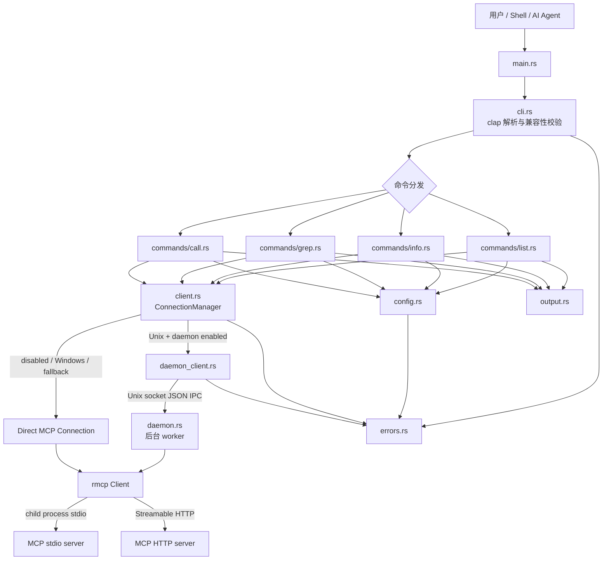
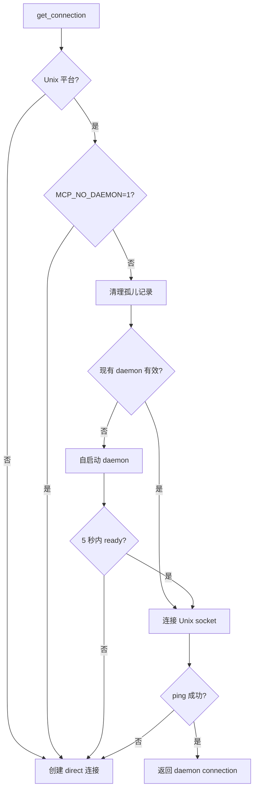

# Design: mcp-cli (Rust)

## 1. 设计目标

`mcp-cli` 是 `reference/mcp-cli` 的 Rust 等价实现。设计目标是在保持命令语义、配置兼容性、输出约定和错误可恢复性的前提下，利用 Rust 单二进制、异步 I/O 和显式资源管理提供更低的启动与运行开销。

主要约束：

- 二进制名称为 `mcp-cli`。
- MCP 协议使用官方稳定版 `rmcp` 2.x 客户端实现，不自行维护协议分支。
- stdio 与 Streamable HTTP 均为一等传输。
- Linux/macOS 支持跨 CLI 调用复用连接的 Unix daemon；Windows 自动使用 direct 模式。
- 行为和测试尽量与 `reference/mcp-cli` 对齐。

## 2. 总体架构



依赖方向保持单向：命令模块依赖配置、连接抽象、输出和错误；连接层依赖配置与 `rmcp`；配置和格式化模块不依赖命令层。这样可单独测试纯逻辑，并避免 daemon 与命令实现互相耦合。

## 3. 模块设计

建议源码结构：

```text
src/
├── main.rs
├── cli.rs
├── config.rs
├── client.rs
├── daemon.rs
├── daemon_client.rs
├── errors.rs
├── output.rs
└── commands/
    ├── mod.rs
    ├── list.rs
    ├── info.rs
    ├── grep.rs
    └── call.rs
```

### 3.1 `main.rs` / `cli.rs`

- `main.rs` 初始化 tokio runtime、解析参数、处理隐藏的 daemon 启动入口并分发命令。
- `cli.rs` 使用 clap derive 描述公开选项和子命令。
- clap 完成语法解析后，再执行参考实现兼容层校验：未知别名建议、`server tool` 歧义检测、空的 `server/`、多余位置参数等。
- 正常退出为 `0`；客户端/参数错误为 `1`；工具执行错误为 `2`；网络错误为 `3`；认证错误为 `4`。SIGINT/SIGTERM 应使用平台约定退出语义。
- daemon 的内部参数不应出现在普通帮助中；可使用隐藏子命令或隐藏标志。

### 3.2 `config.rs`

负责配置路径解析、读取、反序列化、验证、环境变量替换、运行参数读取以及工具过滤。

核心类型建议：

```rust
struct McpServersConfig {
    mcp_servers: BTreeMap<String, ServerConfig>,
}

enum ServerConfig {
    Stdio(StdioServerConfig),
    Http(HttpServerConfig),
}

struct BaseServerConfig {
    allowed_tools: Option<Vec<String>>,
    disabled_tools: Option<Vec<String>>,
}
```

JSON 字段通过 serde rename 保持 `mcpServers`、`allowedTools` 和 `disabledTools` 兼容。服务器顺序应确定化；输出前按名称排序，避免哈希表遍历造成测试和脚本输出漂移。

### 3.3 `client.rs`

- 定义统一的 `McpConnection` 接口，向命令屏蔽 direct/daemon 差异。
- 根据配置创建 `rmcp` 的 `TokioChildProcess` 或 `StreamableHttpClientTransport`。
- 统一提供 `list_tools`、`call_tool`、`get_instructions` 和 `close`。
- 在列举和调用前实施工具过滤，防止绕过 `disabledTools`。
- 包含重试、超时、瞬态错误分类和安全关闭逻辑。

可采用 async trait 或枚举委托：

```rust
#[async_trait]
trait McpConnection: Send {
    async fn list_tools(&self) -> Result<Vec<ToolInfo>>;
    async fn call_tool(&self, name: &str, args: Map<String, Value>) -> Result<Value>;
    async fn get_instructions(&self) -> Result<Option<String>>;
    async fn close(self: Box<Self>);
}
```

具体签名在接入 `rmcp` 2.2.0 后按其公开模型调整，但命令层不得暴露传输具体类型。

### 3.4 `daemon.rs`

Unix 平台后台 worker：

- 由当前可执行文件自启动，例如隐藏入口 `mcp-cli --daemon <server> <encoded-config>`；优先通过受限临时文件或 stdin 传递配置，避免密钥出现在进程参数列表。
- 为一个服务器持有一个 `rmcp` 连接。
- 监听用户私有目录中的 Unix socket。
- 接收换行分隔 JSON 请求，返回同样带 request ID 的 JSON 响应。
- 每次有效请求重置空闲计时器。
- 退出时关闭 MCP 连接，并删除 socket/PID 文件。

### 3.5 `daemon_client.rs`

- 检查 PID 文件、进程存活状态、socket 存在性和 config hash。
- daemon 有效时连接并发送 `ping`；无效或配置陈旧时清理并启动新 worker。
- 启动和请求各设 5 秒快速失败窗口；失败后由连接管理器回退到 direct 模式。
- 扫描并清理进程已不存在的孤儿 PID/socket 文件。

### 3.6 命令模块

- `list.rs`：按 `MCP_CONCURRENCY` 有界并发访问全部服务器，单服务器失败不终止整体结果，最后稳定排序。
- `info.rs`：只连接目标服务器；无 tool 时显示传输、instructions、工具与参数，有 tool 时显示完整输入 schema。
- `grep.rs`：按工具名称执行大小写不敏感 glob 搜索，连接全部服务器，并报告部分失败。
- `call.rs`：只连接目标服务器；优先使用内联 JSON，否则非 TTY stdin，空输入视为 `{}`；调用前验证 JSON object 和工具过滤规则。

### 3.7 `output.rs`

- list/info/grep 输出人类可读文本到 stdout。
- call 输出完整、可管道处理的原始 JSON 到 stdout，不混入诊断信息。
- 错误、警告、debug 和子进程诊断输出到 stderr。
- 仅 stdout/stderr 对应流为 TTY 且未设置 `NO_COLOR` 时输出 ANSI 样式。
- 测试中显式关闭颜色，确保快照稳定。

### 3.8 `errors.rs`

定义可展示且带退出语义的结构化错误：

```rust
struct CliError {
    exit_code: ExitCode,
    kind: ErrorKind,
    message: String,
    details: Option<String>,
    suggestion: Option<String>,
}
```

固定展示格式：

```text
Error [ERROR_TYPE]: message
  Details: ...
  Suggestion: ...
```

内部错误通过 `thiserror` 保留 source chain；命令边界将其转换为面向用户的 `CliError`。`anyhow` 仅用于顶层上下文或测试工具，不替代稳定的错误分类。

## 4. 配置系统

### 4.1 路径优先级

实际解析顺序必须明确且可测试：

1. CLI `-c/--config <path>`；
2. `MCP_CONFIG_PATH`；
3. `<cwd>/mcp_servers.json`；
4. `~/.mcp_servers.json`；
5. `~/.config/mcp/mcp_servers.json`。

显式路径不存在时立即报 `CONFIG_NOT_FOUND`，不继续回退。未提供显式路径时才搜索默认位置，并在失败错误中列出已搜索路径。

> 注：本顺序消除需求文档中“环境变量或 CLI 参数”表达的歧义，并遵循常见的 CLI 参数优先原则；实现测试应固定该行为。

### 4.2 环境变量替换

先将 JSON 解析成 `serde_json::Value`，递归处理字符串节点中的 `${VAR_NAME}`，再反序列化为强类型配置。这样 command、args、env、cwd、url 和 headers 均能替换。

- 默认严格模式：任一变量缺失即返回 `MISSING_ENV_VAR`。
- `MCP_STRICT_ENV=false` 或 `0`：使用空字符串并写警告到 stderr。
- 不记录环境变量实际值，避免 debug/error 泄漏凭据。

### 4.3 服务器验证

每项服务器配置必须满足：

- 对象非 null；
- `command` 与 `url` 恰好存在一个；
- `command` 非空；HTTP URL 可由 URL 解析器接受；
- `args` 为字符串数组，`env`/`headers` 为字符串映射；
- 可选过滤列表为字符串数组；
- stdio 环境由当前进程环境与配置 `env` 合并，配置值覆盖父环境。

### 4.4 工具过滤

过滤模式大小写不敏感，支持：

- `*`：任意数量字符；
- `?`：单个字符。

对工具名进行完整匹配。判定顺序：

1. 命中任一 `disabledTools` → 拒绝；
2. `allowedTools` 非空 → 仅命中时允许；
3. 否则允许。

相同函数同时用于 list/info/grep 的结果过滤和 call 的执行授权，避免展示与执行策略不一致。

## 5. 连接模型

### 5.1 选择流程



Windows 编译时通过 `cfg(unix)` 隔离 daemon 代码，并始终返回 direct connection。公开命令行为保持一致。

### 5.2 Direct 模式

- stdio：构建 `tokio::process::Command`，设置 args/cwd/env，交给 `rmcp::transport::TokioChildProcess`。
- HTTP：构建支持 headers 的 reqwest 客户端和 `StreamableHttpClientTransport`。
- rmcp 完成 initialize/initialized 生命周期。
- 每次 CLI 调用完成后关闭连接和子进程。

## 6. Daemon 与 IPC

### 6.1 文件布局与权限

建议运行目录：

```text
${TMPDIR:-/tmp}/mcp-cli-<uid>/
├── <safe-server-id>.sock
└── <safe-server-id>.pid
```

- 目录权限 `0700`，PID 文件 `0600`。
- server name 必须编码或哈希为安全文件名，禁止路径穿越和分隔符注入。
- PID JSON 包含 `pid`、`config_hash`、`started_at`。

### 6.2 Config hash 与陈旧检测

- 对规范化后的 server config 进行稳定序列化，再计算 SHA-256；至少保留 128 bit 十六进制摘要。
- hash 不匹配时，请求旧 daemon 优雅关闭；必要时发送 SIGTERM，再删除陈旧文件。
- 不将替换后的秘密配置写入 PID 文件；PID 文件只保存 hash。

### 6.3 IPC 协议

请求：

```json
{
  "id": "uuid-or-monotonic-id",
  "type": "listTools | callTool | getInstructions | ping | close",
  "toolName": "optional",
  "args": {}
}
```

响应：

```json
{
  "id": "same-id",
  "success": true,
  "data": {}
}
```

失败响应包含稳定的 `error.code` 和 `error.message`。协议使用换行分帧并设置最大帧大小，必须处理拆包、粘包、无效 JSON 和提前断开，而不是假设一次 read 等于一个请求。

### 6.4 生命周期

1. parent 创建/校验运行目录并启动当前 executable；
2. worker 连接 MCP server、绑定 socket、原子写 PID/ready 状态；
3. parent 在 5 秒内完成 ping；
4. 每次请求重置 `MCP_DAEMON_TIMEOUT`；
5. 空闲、SIGINT、SIGTERM 或 close 时依次停止接入、关闭连接、删除文件；
6. 异常遗留由下次 CLI 启动清理。

## 7. 重试与超时

运行参数：

- 总预算：`MCP_TIMEOUT`，默认 1800 秒；
- 重试次数：`MCP_MAX_RETRIES`，默认 3；
- 基础延迟：`MCP_RETRY_DELAY`，默认 1000ms；
- 单次延迟上限：10 秒或剩余预算允许值。

延迟计算：

```text
base = min(retry_delay * 2^attempt, max_delay)
delay = base ± 25% jitter
```

仅瞬态错误重试：典型网络 errno（ECONNREFUSED、ECONNRESET、ETIMEDOUT、EPIPE、ENETUNREACH、EHOSTUNREACH、EAI_AGAIN）和 HTTP 429/502/503/504。配置、JSON、schema、认证 401/403 和明确的工具业务错误不重试。

每次尝试前检查剩余总预算；睡眠不得耗尽为最终尝试预留的时间。外层使用 `tokio::time::timeout` 防止 transport 永久挂起。重试日志仅在 `MCP_DEBUG` 启用时写 stderr。

## 8. 并发与资源管理

- list/grep 使用 `tokio::sync::Semaphore` 或 `buffer_unordered` 限制并发。
- 收集结果后排序，保证输出确定。
- 单个服务器连接失败转换为该服务器的结果/警告，不取消其他任务。
- info/call 仅连接目标服务器。
- 所有成功创建的连接都在正常、错误和取消路径安全关闭。
- daemon connection 的 `close` 仅关闭 IPC 客户端，不停止后台 worker；worker 由 idle timeout 管理。

## 9. 输出与可观测性

| 内容 | 流 | 格式 |
|------|----|------|
| list/info/grep 结果 | stdout | 人类可读文本 |
| call 结果 | stdout | 完整 JSON |
| 结构化错误 | stderr | `Error [TYPE]...` |
| 警告/debug | stderr | 带 `[mcp-cli]` 前缀 |
| stdio server stderr | stderr | 带 server 前缀，不进入 stdout |

`MCP_DEBUG` 只控制诊断，不改变业务输出或退出码。敏感 headers/env 不能出现在日志、错误详情或 daemon 元数据中。

## 10. 技术栈与可复现构建

建立项目时采用 Rust 2024 edition，并在 `rust-toolchain.toml` 固定已验证的 stable toolchain。依赖使用精确版本作为初始兼容基线，提交 `Cargo.lock`；若某版本与 `rmcp` 2.2.0 的 MSRV/API 不兼容，应在首次脚手架任务中选择当时可用的最新兼容 patch 并同步更新本文。

```toml
[dependencies]
rmcp = { version = "=2.2.0", default-features = false, features = [
  "client",
  "transport-child-process",
  "transport-streamable-http-client-reqwest"
] }
tokio = { version = "=1.47.1", features = ["macros", "rt-multi-thread", "process", "net", "io-util", "signal", "sync", "time", "fs"] }
clap = { version = "=4.5.41", features = ["derive"] }
serde = { version = "=1.0.219", features = ["derive"] }
serde_json = "=1.0.142"
thiserror = "=2.0.12"
anyhow = "=1.0.98"
sha2 = "=0.10.9"
regex = "=1.11.1"
rand = "=0.9.2"
is-terminal = "=0.4.16"
anstyle = "=1.0.11"

[dev-dependencies]
tempfile = "=3.20.0"
assert_cmd = "=2.0.17"
predicates = "=3.1.3"
```

版本号是设计基线而非自动升级范围。依赖变更必须经过：

```bash
cargo update -p <crate> --precise <version>
cargo test --all-features
cargo clippy --all-targets --all-features -- -D warnings
```

## 11. 测试设计

参考测试映射：

| 参考文件 | Rust 覆盖目标 |
|----------|---------------|
| `tests/config.test.ts` | 配置查找、JSON/结构验证、环境变量替换 |
| `tests/filter.test.ts` | allow/disable 优先级及 glob |
| `tests/output.test.ts` | 文本、schema、JSON 与颜色行为 |
| `tests/errors.test.ts` | 错误构造与恢复建议 |
| `tests/grep.test.ts` | `*`、`**`、`?` 和正则字符转义 |
| `tests/client.test.ts` | transport、瞬态错误、重试、关闭 |
| `tests/cli-errors.test.ts` | 22 类 CLI 错误与退出码 |
| `tests/integration/cli.test.ts` | 四个命令端到端行为 |

测试分层：

1. 纯单元测试：配置、filter、glob、格式化、错误分类；
2. 进程级 CLI 测试：stdout/stderr/exit code；
3. mock MCP server 集成测试：stdio 和 HTTP；
4. Unix-only daemon 测试：spawn、IPC、复用、陈旧检测、超时清理；
5. 平台矩阵：Linux/macOS 全功能，Windows direct-only。

## 12. 安全与兼容性注意事项

- daemon 配置不得以明文命令行参数长期暴露；秘密不得落盘。
- socket 目录和文件权限限制为当前用户，拒绝跟随可疑符号链接。
- 对 IPC 帧大小、JSON 深度和 stdin 读取设置合理上限。
- HTTP URL 和 headers 由 rmcp/reqwest 处理；错误输出中脱敏 Authorization/Cookie。
- stdio command 来自用户本地配置，CLI 不通过 shell 拼接执行，直接传递 executable 与 args。
- 与参考实现不一致的行为必须记录在 changelog/兼容性测试中；默认优先保持命令和输出兼容。
